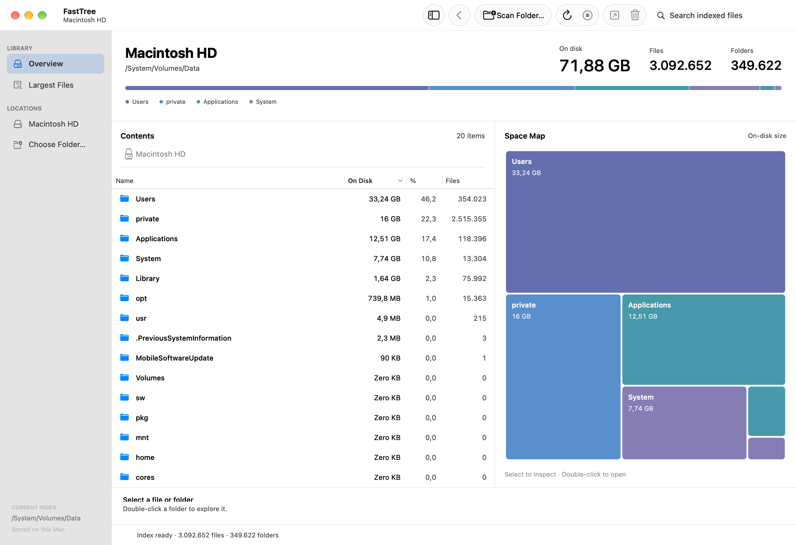

<h1 align="center">FastTree</h1>

<p align="center">
  A fast native disk space analyzer for macOS.
</p>

<p align="center">
  APFS scanning • Interactive treemap • File explorer • Local-only
</p>

<p align="center">
  <a href="https://github.com/leonsuv/FastTree/releases"></a>
  <a href="LICENSE"></a>
  
  
</p>

<p align="center">
  <picture>
    <source media="(prefers-color-scheme: dark)" srcset="screenshots/fasttree-dark.png">
    
  </picture>
</p>

FastTree scans a local volume or folder and presents its contents in a native macOS file explorer and treemap. Scanning and indexing happen on your Mac; FastTree has no analytics, telemetry, account, or network service.

## Download

Get **FastTree v0.2.0** from [GitHub Releases](https://github.com/leonsuv/FastTree/releases/latest). Extract the ZIP and open `FastTree.app`. Requires **Apple silicon and macOS 13 or later**.

The release is not Developer ID signed or notarized. You can also build the app locally using the instructions below.

## Features

- Parallel macOS filesystem traversal using `getattrlistbulk`.
- File and directory index with logical and allocated sizes, modification dates, and parent relationships.
- Native macOS toolbar, translucent sidebar, SF Symbols, and System / Light / Dark appearance.
- Resizable explorer and treemap that fill the window, with a storage breakdown and folder-level totals.
- Clickable path navigation, sortable columns, on-disk percentages, and global filename search.
- **Largest Files** view with the top 3,000 indexed files.
- Squarified treemap with stable colors, hover details, and selection synchronized with the explorer.
- Show selected items in Finder, including multiple selections.
- Move selected items to Trash through a confirmation sheet; report failures and rescan afterward.
- Scan progress, cancellation, and preservation of the last loaded index until a new scan succeeds.
- Persistent local index, reopened when FastTree starts.
- Hardlinks counted once by file ID; symbolic links are not followed.

## Build

Requirements: macOS 13 or later, Apple silicon, and Xcode Command Line Tools (`clang` and Swift).

```bash
git clone https://github.com/leonsuv/FastTree.git
cd FastTree
./build-appkit.sh
```

The app bundle is created at `dist/FastTree.app`. Open it from Finder or run:

```bash
open dist/FastTree.app
```

The build is local and currently unsigned/not notarized. Build from source on your Mac.

## Usage

1. Choose **Scan Folder…** in the toolbar or **Macintosh HD** in the sidebar to scan the data volume.
2. The summary shows the space, files, and subfolders in the current location. Block area represents allocated space, rather than logical file size.
3. Select a row or map block to inspect its full path, on-disk size, and logical size. Double-click a folder to navigate; **Return** also opens the selected row.
4. Click a path component or use **⌘↑** to return to an enclosing folder. **Overview** returns to the scan root.
5. Search all indexed names with **⌘F**, or choose **Largest Files**. Search is capped at 3,000 matches; the map shows the displayed results in these views.
6. Use **Show in Finder** or **Move to Trash…** in the toolbar or context menu. Trash always requires confirmation.
7. Drag the divider to adjust the explorer/map balance. Toggle the sidebar with **⌃⌘S**, and choose an appearance under **View → Appearance**.

| Shortcut | Action |
|---|---|
| ⌘O | Scan a folder |
| ⌘R | Rescan the current scan location |
| ⌘. | Stop scanning |
| ⌘F | Search indexed names |
| ⌘↑ | Enclosing folder |
| ⇧⌘R | Show selection in Finder |
| Return | Open selected file or folder |

[Light screenshot](screenshots/fasttree-light.png) · [Dark screenshot](screenshots/fasttree-dark.png)

Indexes are stored locally in `~/Library/Application Support/FastTree/Indices`. macOS privacy controls can prevent access to protected folders; grant FastTree Full Disk Access if a scan reports skipped items.

## Architecture

The production scanner uses a worker pool and bulk directory metadata reads, then builds and aggregates a compact full tree. `FastTreeCore` exposes the versioned index through a C ABI and memory maps it for navigation and search. The shipped app UI is native AppKit. SwiftUI views are also included under `FastTreeApp/`; the release build uses the AppKit target.

## Performance

Performance depends on the filesystem, storage device, permissions, and number of entries. These are measurements from development, not universal guarantees:

| Run | Dataset | Elapsed time | Memory |
|---|---|---:|---:|
| Local app scan | 3,371,482 files, 885,091 folders, 84.51 GB allocated | 100.6 s | Not measured |
| Scanner selection baseline | 2,000,000 files, 200,000 folders; six workers | 31.74 s median | 175 MiB peak RSS |

The scanner selection result predates the complete retained production index and is not a benchmark of the released app build.

## Limitations

- Scans one selected filesystem tree at a time.
- Protected or changing files may be skipped; Full Disk Access may be needed for complete volume coverage.
- Symbolic links are skipped. Hardlinks are deduplicated by file ID.
- APFS clones, snapshots, and shared extents are not apportioned as physical block ownership.
- Release downloads are not Developer ID signed or notarized.
- Search and Largest Files show at most 3,000 results. The treemap draws up to 159 individual blocks and groups smaller remaining items as **Other items**.

## Development checks

After building, run `./scripts/check-ui.sh` to scan a small fixture and render the actual AppKit window in light, dark, and empty states at the minimum window size. The check verifies panel widths, full-width layout, result counts, valid PNG output, and absence of conflicting Auto Layout constraints.

For a visual capture of an existing index:

```bash
dist/FastTree.app/Contents/MacOS/FastTree \
  --snapshot /tmp/FastTree-light.png \
  --snapshot-root /path/to/scanned/folder \
  --snapshot-index /path/to/index.ftidx \
  --snapshot-appearance light
```

Snapshot mode renders the native window and exits, without replacing the last scanned location. See [UI validation](docs/UI-VALIDATION.md) and [release notes](CHANGELOG.md).

## License

FastTree is released under the [MIT License](LICENSE).
