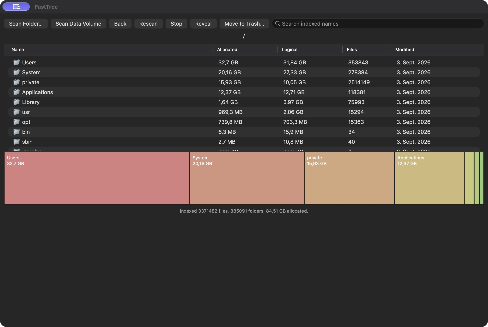

<h1 align="center">FastTree</h1>

<p align="center">
  A fast native disk space analyzer for macOS.
</p>

<p align="center">
  APFS scanning • Interactive treemap • File explorer • Local-only
</p>

<p align="center">
  <a href="https://github.com/leonsuv/FastTree/releases"></a>
  <a href="LICENSE"></a>
  
  
</p>

<p align="center">
  
</p>

FastTree scans a local volume or folder and presents its contents in a native macOS file explorer and treemap. Scanning and indexing happen on your Mac; FastTree has no analytics, telemetry, account, or network service.

## Features

- Parallel macOS filesystem traversal using `getattrlistbulk`.
- File and directory index with logical and allocated sizes, modification dates, and parent relationships.
- Directory navigation, filename search, and scan progress.
- Treemap that opens directories when selected.
- Reveal selected items in Finder.
- Move selected items to Trash after confirmation.
- Persistent local index, reopened when FastTree starts.
- Hardlinks counted once by file ID; symbolic links are not followed.

## Build

Requirements: macOS 13 or later, Apple silicon, and Xcode Command Line Tools (`clang` and Swift).

```bash
git clone https://github.com/leonsuv/FastTree.git
cd FastTree
./build-appkit.sh
```

The app bundle is created at `dist/FastTree.app`. Open it from Finder or run:

```bash
open dist/FastTree.app
```

The build is local and currently unsigned/not notarized. Build from source on your Mac.

## Usage

1. Open FastTree.
2. Choose **Scan Data Volume** or **Scan Folder…**.
3. Double-click a directory in the table to navigate. Use **Back** to return.
4. Search indexed names, select a file or folder, and use **Reveal** or **Move to Trash…**.
5. Select a treemap block to open that directory.

Indexes are stored locally in `~/Library/Application Support/FastTree/Indices`. macOS privacy controls can prevent access to protected folders; grant FastTree Full Disk Access if a scan reports skipped items.

## Architecture

The production scanner uses a worker pool and bulk directory metadata reads, then builds and aggregates a compact full tree. `FastTreeCore` exposes the versioned index through a C ABI and memory maps it for navigation and search. The shipped app UI is native AppKit. SwiftUI views are also included under `FastTreeApp/`; the release build uses the AppKit target.

## Performance

Performance depends on the filesystem, storage device, permissions, and number of entries. These are measurements from development, not universal guarantees:

| Run | Dataset | Elapsed time | Memory |
|---|---|---:|---:|
| Local app scan | 3,371,482 files, 885,091 folders, 84.51 GB allocated | 100.6 s | Not measured |
| Scanner selection baseline | 2,000,000 files, 200,000 folders; six workers | 31.74 s median | 175 MiB peak RSS |

The scanner selection result predates the complete retained production index and is not a benchmark of the released app build.

## Limitations

- Scans one selected filesystem tree at a time.
- Protected or changing files may be skipped; Full Disk Access may be needed for complete volume coverage.
- Symbolic links are skipped. Hardlinks are deduplicated by file ID.
- APFS clones, snapshots, and shared extents are not apportioned as physical block ownership.
- The app currently requires a local source build; the release bundle is not signed or notarized.

## License

FastTree is released under the [MIT License](LICENSE).
